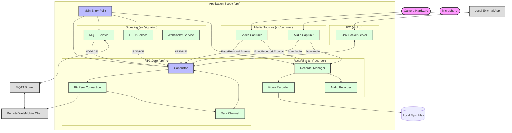

# System Architecture

This document provides a high-level overview of how the various modules in `src/` interact to form the complete application.

## High-Level Component Diagram

## Module Responsibilities

1.  **`src/capturer` (Producer)**:
    *   Interfaces with V4L2 or Libcamera to get video frames.
    *   Interfaces with PulseAudio to get audio samples.
    *   Acts as the *Source of Truth* for media data.

2.  **`src/rtc` (Consumer 1 & Controller)**:
    *   **Conductor**: Central hub. It owns the capturers and creates peers.
    *   **RtcPeer**: Encapsulates a WebRTC connection. It takes frames from the capturer (via Conductor) and streams them to the network.
    *   **RtcChannel**: Handles non-media data (commands, IoT control).

3.  **`src/recorder` (Consumer 2)**:
    *   **Independently** subscribes to the `src/capturer`.
    *   Records the same frames to disk that `src/rtc` is streaming.
    *   Operates even if no peer is connected.

4.  **`src/signaling` (Negotiator)**:
    *   Handles the specific protocol (MQTT, HTTP, WebSocket) to exchange metadata (SDP, ICE) with clients.
    *   Tells the `Conductor` when to create a new `RtcPeer`.
    *   Doesn't touch media data itself.

5.  **`src/ipc` (Bridge)**:
    *   Allows local processes to piggyback on the WebRTC Data Channel.
    *   Routes messages: `Unix Socket <-> Conductor <-> RtcChannel`.
