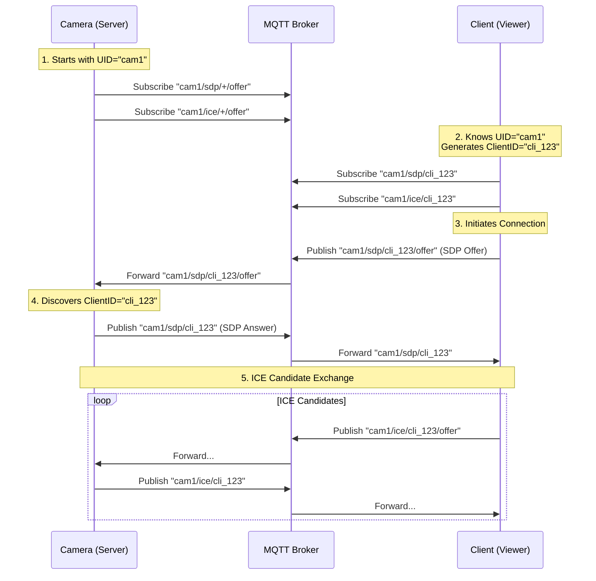

# MQTT Signaling Service Implementation Details

This document explains the implementation of the MQTT signaling service in `src/signaling/mqtt_service.cpp`, specifically focusing on how topics are structured and used for exchanging SDP and ICE candidates.

## Topic Structure

The service uses a base topic structure that can optionally include a unique identifier (`uid`) for the device. The base topics for SDP and ICE are constructed as follows:

- **SDP Base Topic (`sdp_base_topic_`)**: `[uid]/sdp`
- **ICE Base Topic (`ice_base_topic_`)**: `[uid]/ice`

*Note: If `uid` is empty, the topics start directly with `sdp` or `ice`.*

## Subscription (Receiving Messages)

The service acts as a WebRTC server (signaler) and listens for incoming connection offers from clients.

### 1. SDP Offers
The service subscribes to:
```
[uid]/sdp/+/offer
```
- The `+` is a wildcard representing the `client_id` of the remote peer.
- The `/offer` suffix indicates that the message is an offer from a client.

**How it works:**
1. A client publishes an SDP offer to `[uid]/sdp/[client_id]/offer`.
2. The `OnMessage` handler triggers.
3. `GetClientId` extracts the `client_id` from the topic.
4. The service creates a new `Peer` associated with this `client_id`.
5. The payload (SDP JSON) is processed.

### 2. ICE Candidates
The service subscribes to:
```
[uid]/ice/+/offer
```
- Similar to SDP, it listens for ICE candidates sent by clients on this pattern.

## Publishing (Sending Messages)

When the service generates a local SDP answer or ICE candidate, it publishes it back to a specific topic dedicated to that client.

### 1. SDP Answers
The service publishes to:
```
[uid]/sdp/[client_id]
```
- **Difference from Subscribe**: Note that it does **not** append `/answer` or `/offer` or `/answer` to the subscribe pattern. It publishes directly to the client's specific SDP topic.
- The client is expected to be subscribed to this topic to receive the answer.

### 2. ICE Candidates
The service publishes to:
```
[uid]/ice/[client_id]
```
- Similar to SDP, local ICE candidates are sent directly to the client's specific ICE topic.

## Code Reference

### Topic Construction (`GetTopic`)
```cpp
// src/signaling/mqtt_service.cpp

std::string MqttService::GetTopic(const std::string &topic, const std::string &client_id) const {
    std::string result;
    if (!uid_.empty()) {
        result = uid_ + "/";
    }
    result += topic;
    if (!client_id.empty()) {
        result += "/" + client_id;
    }
    return result;
}
```

### Subscription Logic (`OnConnect`)
```cpp
// src/signaling/mqtt_service.cpp

void MqttService::OnConnect(struct mosquitto *mosq, void *obj, int rc) {
    if (rc == 0) {
        // ...
        Subscribe(sdp_base_topic_ + "/+/offer");
        Subscribe(ice_base_topic_ + "/+/offer");
        // ...
    } // ...
}
```

### Publishing Logic (`AnswerLocalSdp`)
```cpp
// src/signaling/mqtt_service.cpp

void MqttService::AnswerLocalSdp(const std::string &peer_id, const std::string &sdp, ... ) {
    // ...
    // peer_id_to_client_id_ maps the internal peer ID back to the MQTT client_id
    Publish(GetTopic("sdp", peer_id_to_client_id_[peer_id]), jsonString);
}
```

## Summary Table

| Action | Content | Topic Pattern |
| :--- | :--- | :--- |
| **Subscribe** | Remote SDP Offer | `[uid]/sdp/+/offer` |
| **Subscribe** | Remote ICE Candidate | `[uid]/ice/+/offer` |
| **Publish** | Local SDP Answer | `[uid]/sdp/[client_id]` |
| **Publish** | Local ICE Candidate | `[uid]/ice/[client_id]` |

## Connection Establishment / Pairing

There is no explicit "pairing" phase outside of MQTT. The connection is established based on a **Known UID** and **Client-Initiated Discovery**.

1.  **Shared Secret (UID)**: The Client (viewer) **must know** the `uid` of the Camera (server) beforehand. This is typically configured in the client application or shared manually.
2.  **Client Identity**: The Client generates its own random `client_id`.
3.  **Discovery**:
    - The Camera subscribes to `[uid]/sdp/+/offer`, effectively listening for *any* client.
    - The Client publishes an OFFER to `[uid]/sdp/[client_id]/offer`.
    - The Camera receives the message, extracts the `client_id` from the topic, and uses it to send the ANSWER back to `[uid]/sdp/[client_id]`.
    - No prior registration of the `client_id` is required on the Camera.

### Sequence Diagram


