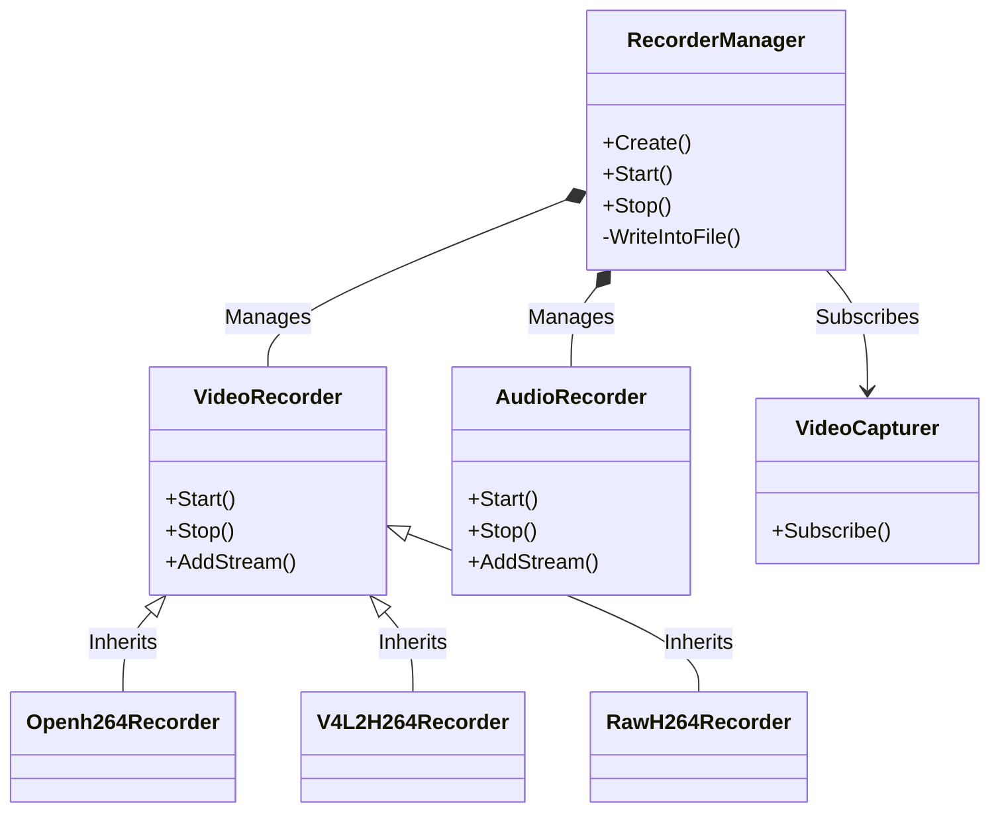

# Recorder Implementation Design (`src/recorder`)

The `src/recorder` directory implements the **Continuous Recording** feature of the application. Unlike `src/rtc` (which handles live streaming to peers), `src/recorder` is responsible for saving the camera and microphone feeds to the local disk.

## Architecture

The recording system is designed to be **always-on** (if configured) and independent of peer connections. It integrates directly with the `VideoCapturer` and `PaCapturer` via a subscription model.

## Key Components

### 1. RecorderManager (`recorder_manager.cpp`, `recorder_manager.h`)
The central coordinator for recording.
*   **Packet Muxing**: It creates the FFmpeg container context (`AVFormatContext`) for `.mp4` files. It receives encoded packets from both video and audio recorders and writes them effectively to the same file (`av_interleaved_write_frame`).
*   **Lifecycle Management**:
    *   **Startup**: Waits for the first **Keyframe** from the video source before starting to write to a file, ensuring every video file is playable from the start.
    *   **File Rotation**: Monitors the duration of the current recording. When `config.file_duration` is reached, it closes the current file and opens a new one (seamlessly splitting files).
    *   **Disk Space Management**: A background worker checks free disk space. If space is low (`MIN_FREE_BYTE`), it deletes the oldest files (`Utils::RotateFiles`).
*   **Preview Image**: Generates a JPEG snapshot for each video file to serve as a thumbnail.

### 2. VideoRecorder Interface (`video_recorder.h`)
Abstract base class for different video encoding/handling strategies.
*   **Responsibility**: Receives frames (or packets) from the capturer, ensures they are in the correct format for the container, and passes them to the `RecorderManager`.

### 3. VideoRecorder Implementations
The system selects the appropriate implementation based on the available hardware and configuration:

*   **`RawH264Recorder`**:
    *   **Use Case**: When the camera itself outputs H.264 (e.g., Logitech C920).
    *   **Efficiency**: Extremely high. It just takes the pointers from the V4L2 buffer and passes them to the MP4 container. **Zero copy, zero re-encoding.**

*   **`V4L2H264Recorder` (Raspberry Pi)**:
    *   **Use Case**: When using the Pi's Hardware Encoder (M2M).
    *   **Efficiency**: High. It takes raw frames, sends them to the `/dev/video11` encoder, and puts the result into the MP4 container.

*   **`Openh264Recorder`**:
    *   **Use Case**: Fallback software encoding.
    *   **Efficiency**: Low (high CPU usage). Used if no hardware acceleration is available.

*   **`JetsonRecorder`**:
    *   **Use Case**: NVIDIA Jetson platforms.

### 4. AudioRecorder (`audio_recorder.cpp`)
*   **Encoding**: Encodes raw PCM audio from `PaCapturer` (PulseAudio) into **AAC** format using FFmpeg's `libavcodec`.
*   **Buffering**: Manages an audio FIFO buffer to ensure fixed frame sizes required by the AAC encoder.

## Data Flow

1.  **Capture**: `VideoCapturer` produces a frame (Raw YUV or Compressed H.264).
2.  **Dispatch**: The frame is pushed to `RecorderManager` via a subscription callback.
3.  **Processing**:
    *   If **Raw**: The `VideoRecorder` encodes it (HW or SW).
    *   If **Compressed**: The `RawH264Recorder` wraps it in an `AVPacket`.
4.  **Muxing**: `RecorderManager` takes the `AVPacket`, locks the mutex, and writes it to the `.mp4` file context.
5.  **Storage**: The file is saved to `config.record_path`.

## Dependencies
*   **FFmpeg (libavformat, libavcodec, libavutil)**: Used for Muxing (MP4 creation) and Audio Encoding (AAC).
*   **V4L2**: For hardware encoding support on Pi.
