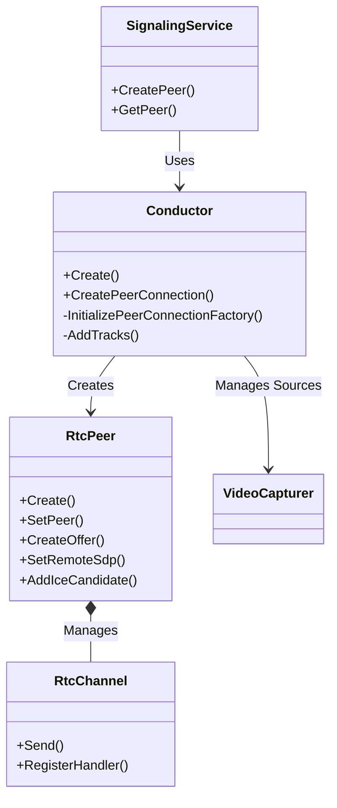
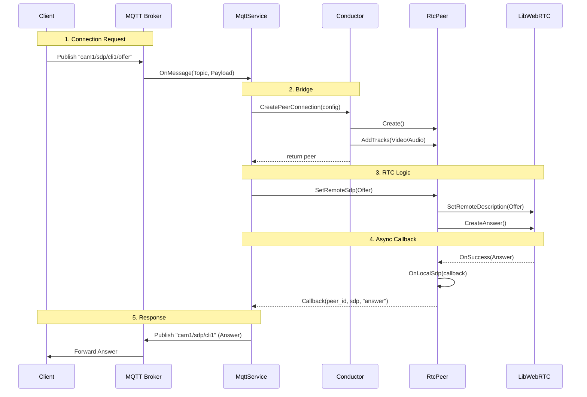

# RTC Implementation Design (`src/rtc`)

The `src/rtc` directory contains the core logic that bridges the application's Signaling Services (MQTT, WebSocket, HTTP) with the underlying Google WebRTC library (`libwebrtc`). It manages the lifecycle of Peer Connections, Media Tracks, and Data Channels.

## Architecture Overview

The `Conductor` class acts as the central controller. It initializes the WebRTC Factory, manages Audio/Video sources (Capturers), and orchestrates the creation of `RtcPeer` instances.

## Key Components

### 1. Conductor (`conductor.cpp`, `conductor.h`)
**Role:** The "Brain" of the RTC layer.
*   **Initialization**: Configures the `PeerConnectionFactory` with the necessary threads (Network, Worker, Signaling) and media engines.
*   **Source Management**:
    *   Creates and holds the `VideoCapturer` (Camera) and `PaCapturer` (Microphone).
    *   Creates the `VideoTrack` and `AudioTrack` from these sources.
*   **Bridging Function**:
    *   When a Signaling Service (e.g., MQTT) receives a connection request, it calls `conductor->CreatePeerConnection()`.
    *   The Conductor creates a new `RtcPeer`, attaches the existing Audio/Video tracks to it, and returns it to the Signaling Service.

### 2. RtcPeer (`rtc_peer.cpp`, `rtc_peer.h`)
**Role:** Represents a single WebRTC connection to a remote client.
*   **Wraps**: `webrtc::PeerConnectionInterface`.
*   **Responsibility**:
    *   **Signaling State Machine**: Handles `CreateOffer`, `CreateAnswer`, `SetLocalDescription`, `SetRemoteDescription`.
    *   **ICE Handling**: Gathering local candidates and adding remote candidates.
    *   **Callbacks**: It exposes callbacks (`OnLocalSdp`, `OnLocalIce`) that the Signaling Service subscribes to, allowing the RtcPeer to "push" messages back out to the network without knowing about MQTT/HTTP itself.

### 3. RtcChannel (`rtc_channel.cpp`, `rtc_channel.h`)
**Role:** Wrapper for `webrtc::DataChannelInterface`.
*   **Function**: Handles non-media data exchange.
*   **Command Parsing**: It listens for incoming text messages on specific channels (Command, Reliable, Lossy) and triggers handlers in the `Conductor`.
*   **Features**:
    *   **IPC Bridge**: Can route messages between the WebRTC Peer and a local Unix Socket (for controlling the device from another local process).
    *   **Commands**: Handles "snapshot", "metadata", and "recording" commands.

### 4. SfuChannel (`sfu_channel.cpp`, `sfu_channel.h`)
**Role:** Specialized Data Channel for SFU (Selective Forwarding Unit) integration.
*   **Protocol**: Uses Protocol Buffers (`proto/livekit_models.pb.h`) to communicate with a LiveKit SFU.
*   **Purpose**: Allows the device to participate in a room where an SFU manages the routing of data, rather than just P2P.

### 5. CustomizedVideoEncoderFactory (`customized_video_encoder_factory.cpp`)
**Role:** Integrates Hardware Acceleration.
*   **Function**: Injects custom video encoder implementations (like `V4L2H264Encoder` for Pi or `JetsonVideoEncoder`) into the WebRTC stack, bypassing the default software encoders (libvpx/openh264) when hardware acceleration is available.

## bridging Flow: Signaling <-> LibWebRTC

The following sequence illustrates how `src/rtc` bridges a request from the Signaling Layer (e.g., MQTT) to the WebRTC library.

### Scenario: Client Connects (Client-Initiated)

1.  **Signaling Layer**: `MqttService` receives an MQTT message `.../offer` containing the Client's SDP.
2.  **Bridge (Conductor)**:
    *   `MqttService` calls `conductor->CreatePeerConnection(config)`.
    *   `Conductor` creates `RtcPeer`.
    *   `Conductor` adds the global `VideoTrack` (Camera) to this new `RtcPeer`.
3.  **RTC Logic (RtcPeer)**:
    *   `MqttService` calls `peer->SetRemoteSdp(offer)`.
    *   `RtcPeer` calls `webrtc::PeerConnection::SetRemoteDescription()`.
    *   `RtcPeer` calls `webrtc::PeerConnection::CreateAnswer()`.
4.  **Callback to Signaling**:
    *   When LibWebRTC generates the Answer, `RtcPeer` triggers its `OnLocalSdp` callback.
    *   `MqttService` (which is listening to this callback) receives the SDP string.
5.  **Signaling Layer**: `MqttService` publishes the SDP Answer back to the MQTT broker.

This design decouples the *Signaling Protocol* from the *Media Logic*, allowing the app to support MQTT, WebSocket, and HTTP simultaneously.

### Sequence Diagram

